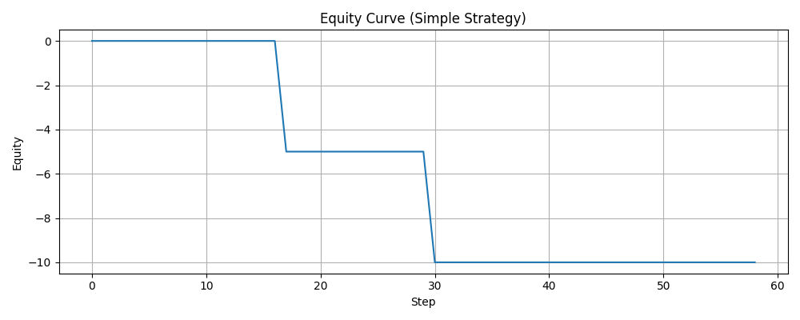

# Quant Challenge — Delta Signal Research

---

## 1. Введение

В рамках тестового задания реализован полный пайплайн ресёрча и тестирования торгового сигнала на основе дельты Level 2 ордербука Bybit (Testnet).

**Цель:** проверить гипотезу о прибыльности простой стратегии на всплесках дельты стакана. Все этапы автоматизированы и легко воспроизводимы.

---

## 2. Описание стратегии

- **Сигнал long:** дельта превышает положительный порог (`> 0.001`)
- **Сигнал short:** дельта меньше отрицательного порога (`< -0.001`)
- При каждом сигнале открывается новая позиция, предыдущая позиция закрывается.
- Доход рассчитывается как разница между midprice в момент входа и выхода из позиции (`midprice` = среднее между лучшим bid и ask).

---

## 3. Параметры эксперимента

- **Инструмент:** BTCUSDT (Testnet)
- **Период сбора:** 2025-07-19 21:51:09 — 2025-07-19 21:52:09
- **Интервал между снапшотами:** 1 секунда
- **Общая длительность:** 1 минута
- **Порог сигнала (threshold):** 0.001
- **Цена сделки:** midprice (среднее между лучшим bid и ask)

---

## 4. Результаты

- **Финальный PnL:** -10.0
- **Количество сигналов:** 15
- **Максимальная просадка:** 10.0

**Equity Curve:**



---

## 5. Выводы

- На коротком тестовом отрезке и при малой волатильности простая стратегия на основе дельты не показала положительной доходности.
- Пайплайн реализован полностью: от сбора данных до симуляции и отчёта. Все шаги воспроизводимы.
- Для более содержательных выводов рекомендуется:
    - собирать данные дольше или на реальном рынке,
    - подбирать другие параметры порога,
    - учитывать биржевые комиссии.

---

## 6. Как воспроизвести эксперимент

Выполнить команды из корня проекта:

```bash
python src/main.py --mode collect --symbol BTCUSDT --minutes 1 --interval 1.0
python src/main.py --mode analyze
python src/main.py --mode backtest
python src/main.py --mode report
